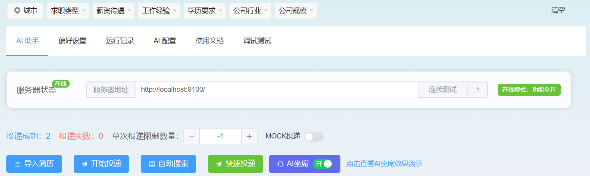

# AI Job Hunting

AI Job Hunting 是一个面向 Boss 直聘的求职自动化项目。项目通过浏览器用户脚本嵌入 Boss 直聘页面，提供批量投递、自动搜索、快速投递、AI 坐席、消息辅助回复、简历导入和高意向通知等能力；后端负责 AI 调用、用户配置、订单支付、数据持久化和 SSE 通知。

本仓库基于原项目二次维护：

- 原作者：`github.com/yangfeng20`
- 旧版说明：[README-old.md](./README-old.md)
- 部署参考：[部署指南v1.md](./部署指南v1.md)

## 功能

- 批量投递：按当前 Boss 搜索结果批量沟通岗位，支持单次投递数量限制。
- 个人简历补发 New!：按已经成功筛选出来的岗位，补发期间单个或多个岗位未成功沟通的简历信息。
- 自动搜索 New!：按页面关键词库依次搜索岗位，每个关键词停留一段时间后切换下一条。
- 快速投递 New!：按页面关键词库搜索岗位，当前关键词投递完成后立即搜索下一条。
- 模糊快投 New!：选择已配置的模糊词库规则后，按规则扩展相似岗位关键词并批量投递。
- 搜索参数复用 New!：自动搜索、快速投递和模糊快投会保留当前 Boss 搜索页的筛选条件，只替换关键词。
- 投递后置发送队列 New!：投递成功后自定义招呼语和图片简历会进入待发送队列，聊天通道就绪后自动补发，不阻塞后续投递。
- 关键词库 New!：前端页面维护自动搜索、快速投递关键词；模糊快投使用独立的模糊词库规则。
- AI 坐席：结合简历信息辅助回复 HR 消息，支持预设问题、拒绝挽留、交换联系方式等场景。
- 简历导入：从 Boss 侧导入简历信息，供 AI 回复和偏好配置使用。
- 高意向通知：根据关键词、对话轮数等条件发送邮件通知。
- 商业化能力：后端包含支付宝订单、产品权限、试用能力等模块。

## 架构

```text
Boss 直聘页面
  |
  | 注入用户脚本
  v
ai-job-hunting-ui
Vue 3 + Vite + vite-plugin-monkey + Element Plus
  |
  | HTTP / SSE
  v
ai-job-hunting-server
Spring Boot 3 + Spring AI + MyBatis Plus
  |
  +-- MySQL
  +-- OpenAI Compatible / Kimi
  +-- Alipay
  +-- SmartConfig
```

## 目录

```text
.
├── ai-job-hunting-ui/       # 浏览器用户脚本前端
├── ai-job-hunting-server/   # Spring Boot 后端
├── file/                    # README 截图素材
├── common/                  # 关键词库等辅助材料
├── Makefile                 # 常用开发和部署命令
├── Docker-Windows快速使用.md # Windows + Docker 补充说明
├── README-old.md            # 原 README 归档
└── 部署指南v1.md             # 原部署文档
```

## 环境要求

- JDK 17
- Maven 3.8+
- Node.js 18+
- pnpm
- Docker 和 Docker Compose，可选，用于启动 MySQL 或整套服务
- Tampermonkey 或兼容的用户脚本管理器

Windows PowerShell 如果拦截 `pnpm` 脚本，可以使用 `pnpm.cmd`。

## Windows + Docker 快速启动

本项目仅仅用于个人使用，默认项目启动者为普通使用者，非开发者。已修改后端配置，跳过付费选项和前端提醒

### 1. 环境配置

- JDK 17
- Maven 3.8+
- Node.js 18+
- Docker windows

### 2. 最小修改

tips: `kimi key`需要通过`kimi`官网获取，链接：https://platform.kimi.com

在该`ai-job-hunting-server\src\main\resources\`路径下，修改两个`properties`文件中的`kimi api`，即`spring.ai.kimi.api-key=xxx`

### 3. 打包并启动 MySQL、后端

在项目根目录执行：

```powershell
mvn.cmd -f .\ai-job-hunting-server\pom.xml -DskipTests package
docker compose -f .\ai-job-hunting-server\src\main\resources\docker\docker-compose.yml up -d --build
```

### 4. 启动并安装前端用户脚本

新开一个 PowerShell 窗口，在项目根目录执行：

```powershell
Set-Location .\ai-job-hunting-ui
npm install --legacy-peer-deps
npm run dev
```

浏览器已安装 Tampermonkey 时，打开 `http://127.0.0.1:5173/` 安装开发版用户脚本。随后进入 Boss 直聘岗位列表页，在功能面板中将服务器地址设置为 `http://localhost:9100`。

### 5. 停止或重建

```powershell
# 停止容器，保留 MySQL 数据
docker compose -f .\ai-job-hunting-server\src\main\resources\docker\docker-compose.yml down

# 修改后端配置或代码后，重新打包并重建后端容器
mvn.cmd -f .\ai-job-hunting-server\pom.xml -DskipTests package
docker compose -f .\ai-job-hunting-server\src\main\resources\docker\docker-compose.yml up -d --build ai-job
```

需要删除 MySQL 数据并完全初始化时，使用 `down -v`。该操作会永久删除当前 Compose 项目的数据库数据，请先确认无需保留。

### 常见问题：

1、后端报错：图片无法上传的问题

解决方法：充值 kimi

2、前端报错：AI助力链接失败

解决方法：配置 kimi api

3、岗位在哪里配置？

解决方法：在项目正常启动后，在页面中配置

4、页面现实没有链接上 AI

解决方法：在项目正常启动后，在页面中`AI配置`中配置个人AI

5、岗位如何投递，会投递什么信息给 HR

答：在项目正常启动，且已经配置个人AI、岗位词库后，项目会按照词库进行筛选投递，投递结果可以在页面的"消息"中查看


## 快速开始

### 1. 准备后端配置

真实配置文件不会提交到 Git。首次启动前从 example 文件复制：

```powershell
Copy-Item ai-job-hunting-server/src/main/resources/application.properties.example ai-job-hunting-server/src/main/resources/application.properties
Copy-Item ai-job-hunting-server/src/main/resources/application-dev.properties.example ai-job-hunting-server/src/main/resources/application-dev.properties
```

需要重点修改：

```properties
spring.ai.kimi.api-key=xxx
spring.ai.openai.api-key=xxx
spring.datasource.url=jdbc:mysql://localhost:3306/ai_job?...
spring.datasource.username=xxx
spring.datasource.password=xxx
openai.pool.config.list=[...]
```

如果只是本地自用，可以先开启：

```properties
product.permission.skip=true
```

不要把真实的 `application.properties` 和 `application-dev.properties` 提交到仓库。

### 2. 启动 MySQL

```bash
make mysql-up
```

如需修改 MySQL 密码、端口或库名，可以通过环境变量覆盖 `docker-compose.yml` 中的默认值：

```bash
MYSQL_ROOT_PASSWORD=your_password MYSQL_PORT=3306 make mysql-up
```

### 3. 启动后端

```bash
make server-dev
```

默认后端端口：

- API 服务：`http://localhost:9100`
- SmartConfig：`http://localhost:6768`

### 4. 启动前端开发

```bash
make ui-dev
```

前端是用户脚本项目。开发时根据 Vite 输出地址安装开发版脚本，或构建后使用产物。

### 5. 构建用户脚本

```bash
make ui-build
```

构建产物位于：

```text
ai-job-hunting-ui/dist/ai-job-hunting.user.js
```

也可以使用根目录已有脚本：

- [ai-job-hunting.user.js](./ai-job-hunting.user.js)：依赖 CDN 的版本。
- [ai-job-hunting.bundle.user.js](./ai-job-hunting.bundle.user.js)：内置依赖的版本，网络环境不稳定时优先使用。

### 6. 在 Boss 页面使用

安装用户脚本后，进入 Boss 直聘岗位列表页：

```text
https://www.zhipin.com/web/geek/jobs
```

在页面面板中配置服务器地址，例如：

```text
http://localhost:9100
```

点击连接测试，成功后即可使用导入简历、投递、自动搜索、快速投递、模糊快投和 AI 坐席能力。

## 常用命令

```bash
make help            # 查看命令
make mysql-up        # 启动 MySQL
make mysql-down      # 停止 MySQL
make server-dev      # dev profile 启动后端
make server-package  # 打包后端 jar
make ui-dev          # 启动前端开发服务
make ui-build        # 构建用户脚本
make docker-up       # 打包后端并启动 MySQL + 后端
make docker-down     # 停止 Docker 服务
make docker-logs     # 查看后端容器日志
make docker-clean    # 停止服务并删除 Docker volume
```

## 前端自动搜索配置

自动搜索和快速投递使用页面中的 `搜索关键词` 维护关键词库；`autoSearchKeywords.ts` 只作为首次加载和恢复默认时的默认词库。搜索页地址、默认 URL 参数和筛选复用开关使用页面中的 `搜索参数` / `参数设置` 维护；`autoSearchConfig.ts` 只作为首次加载和恢复默认时的默认配置。模糊快投使用页面中的 `模糊词库` 维护种子词扩展规则。

搜索参数的默认值来自前端配置文件：

```text
ai-job-hunting-ui/src/config/autoSearchConfig.ts
```

tips: 

页面 `搜索关键词` 中的岗位关键词可以通过 AI 生成后粘贴保存；

页面 `搜索参数` 中的 URL 参数基于 Boss 直聘官方 URL 参数进行配置，如

```text
url：https://www.zhipin.com/web/geek/jobs?city=100010000

// 筛选条件-全国城市
defaultParams: {
        city: "100010000",
    }

url：https://www.zhipin.com/web/geek/jobs?city=100010000&experience=101

// 筛选条件-全国城市、经验不限
defaultParams: {
        city: "100010000",
        experience:"101",
    }
```

如果本地缺少配置文件，可以从示例文件复制：

```powershell
Copy-Item ai-job-hunting-ui/src/config/autoSearchKeywords.ts.example ai-job-hunting-ui/src/config/autoSearchKeywords.ts
Copy-Item ai-job-hunting-ui/src/config/autoSearchConfig.ts.example ai-job-hunting-ui/src/config/autoSearchConfig.ts
```

### `autoSearchKeywords.ts`

该文件维护自动搜索和快速投递的默认关键词列表。实际使用时，优先读取浏览器本地保存的 `搜索关键词`；当本地没有保存过关键词或点击恢复默认时，才会使用这里的默认值：

```ts
export const AUTO_SEARCH_KEYWORDS: string[] = [
    "Go 后端开发工程师",
    "Golang 后端开发工程师",
    "Go后端",
];
```

说明：

- 自动搜索和快速投递会按数组顺序从上到下执行；模糊快投不读取这里的关键词，而是读取页面 `模糊词库` 中启用的投递规则。
- 越重要、越精准的关键词应该排在越前面。
- 每一项只放岗位关键词，不要放完整 URL。
- 关键词会在搜索 URL 中写入 `query` 参数。
- 页面中点击 `搜索关键词` 可以新增、删除或重排关键词；保存后会写入当前浏览器本地存储。

### `autoSearchConfig.ts`

该文件维护搜索页地址和默认筛选参数的默认值。实际运行时，优先读取浏览器本地保存的 `搜索参数`；当本地没有保存过配置或点击恢复默认时，才会使用这里的默认值：

```ts
export const AUTO_SEARCH_CONFIG: AutoSearchConfig = {
    baseUrl: "https://www.zhipin.com/web/geek/jobs",
    defaultParams: {
        city: "101280600",
        experience: "101",
    },
    reuseCurrentSearchParams: true,
};
```

字段说明：

- `baseUrl`：Boss 岗位搜索页地址。
- `defaultParams`：默认 URL 查询参数，会拼到搜索地址上；常见参数包括 `city`、`experience` 等。
- `reuseCurrentSearchParams`：是否复用当前 Boss 搜索页已有筛选条件。
- 页面中点击 `参数设置` 可以维护 `baseUrl` 和默认 URL 参数，也可以从当前 Boss 搜索页导入已经筛好的参数。

运行规则：

- `query` 不需要写在 `defaultParams`，程序会自动用当前关键词覆盖。
- 当 `沿用BOSS筛选` 开启，且当前页面已经是 Boss 搜索页时，会保留当前页面筛选条件，只替换 `query`。
- `defaultParams` 只会补齐当前 URL 缺少的参数，不会覆盖你已经在页面上筛选好的参数。
- 当 `沿用BOSS筛选` 关闭时，每次搜索都从 `baseUrl + defaultParams + query` 生成新地址。

使用建议：先在 Boss 页面手动筛选城市、薪资、经验、学历等条件，再点击 `参数设置` 中的 `从当前页面导入`；如果希望每次都使用固定筛选条件，关闭页面上的 `沿用BOSS筛选`。

### 模糊快投

模糊快投适合在已经配置好岗位偏好和过滤规则后，快速扩大候选岗位来源并尽快用完设定的投递数量。页面上的模糊快投区域包含以下控件：

- `投递规则`：选择 `模糊词库` 中已启用的规则；未配置或未启用规则时不能开始模糊快投。
- `本轮最多投递`：本次模糊快投最多成功投递的岗位数量，并会按扩展关键词数量分摊单次投递上限。
- `沿用BOSS筛选`：保留当前 Boss 搜索页的城市、薪资、经验、学历等筛选条件，只替换搜索关键词。
- `AI匹配过滤`：复用偏好设置中的 AI 语义匹配过滤，不单独维护第二套 AI 过滤状态。
- `开始模糊快投`：按扩展后的关键词队列开始搜索和投递；运行中按钮会变为 `停止模糊快投`。
- `模糊词库`：在页面中维护 `种子关键词 -> 扩展搜索关键词` 规则，保存到当前浏览器本地存储，并作为模糊快投的唯一启动来源。

运行规则：

- 先在 `模糊词库` 中配置并启用规则，例如 `Go -> Go后端、Golang、服务端开发、云原生开发`。
- 在 `投递规则` 下拉框中选择一条启用规则后才能开始；找不到启用规则时不会启动，也不会走临时兜底扩展。
- 如果存在扩展词，完全相同的种子词会被排除，避免反复搜索种子词本身。
- `本轮最多投递` 会按扩展关键词数量分摊单次投递上限，避免第一个关键词结果过多时占完整轮额度。
- 每个扩展关键词都会复用现有搜索跳转逻辑，并继续执行现有 `matchJob -> push -> pushAfterHandler` 投递链路。
- 是否复用当前 Boss 筛选条件由页面上的 `沿用BOSS筛选` 开关控制。
- `AI匹配过滤` 开关复用偏好设置中的 AI 过滤能力，不单独维护第二套过滤状态。
- 达到模糊快投设置的最大投递数量、Boss 当日上限、关键词队列执行完、连续过滤阈值或用户手动停止时会结束。
- 运行状态、岗位处理状态和模糊快投词库会写入浏览器本地存储，自动刷新或手动刷新后会尽量继续当前任务并跳过已处理岗位。

### 投递后置发送队列

自定义招呼语和图片简历依赖 Boss 聊天 WebSocket。岗位列表页刚完成投递时，聊天通道可能尚未就绪。为避免后置发送阻塞批量投递，当前流程会将这些动作写入本地待发送队列：

- 投递成功会先计为成功，不会因为招呼语或图片简历暂时发送失败而回滚。
- 如果聊天通道已就绪，会立即补发待发送动作。
- 如果聊天通道未就绪，会保留为 `pending`，页面刷新或通道初始化成功后继续补发。
- 同一岗位同一种动作会去重，避免重复发送。
- 超过重试上限后会标记为 `failed`，日志中会显示补发失败原因。

## 配置与安全

必须忽略的本地配置：

```text
ai-job-hunting-server/src/main/resources/application.properties
ai-job-hunting-server/src/main/resources/application-dev.properties
```

这些文件已加入 [ai-job-hunting-server/.gitignore](./ai-job-hunting-server/.gitignore)。

安全要求：

- 不要提交 API Key、数据库密码、支付宝私钥、真实回调地址。
- 如果密钥曾经进入 Git 历史，需要立即轮换密钥。
- example 文件只放占位符，不放个人真实部署信息。
- 生产部署建议通过环境变量或容器 Secret 注入敏感配置。

## 截图

首页面板：



AI 配置：


## 关键文件

- [ai-job-hunting-ui/src/components/ui/AiJob.vue](./ai-job-hunting-ui/src/components/ui/AiJob.vue)：投递、自动搜索、快速投递、模糊快投主面板。
- [ai-job-hunting-ui/src/services/autoSearchKeywords.ts](./ai-job-hunting-ui/src/services/autoSearchKeywords.ts)：自动搜索和快速投递关键词读取、保存、恢复默认和清洗逻辑。
- [ai-job-hunting-ui/src/services/autoSearchRuntimeConfig.ts](./ai-job-hunting-ui/src/services/autoSearchRuntimeConfig.ts)：自动搜索搜索页地址、默认 URL 参数和筛选复用配置的读取、保存和恢复默认逻辑。
- [ai-job-hunting-ui/src/config/fuzzyPushDefaultRules.ts](./ai-job-hunting-ui/src/config/fuzzyPushDefaultRules.ts)：模糊快投默认种子词和扩展词规则。
- [ai-job-hunting-ui/src/services/fuzzyPushRules.ts](./ai-job-hunting-ui/src/services/fuzzyPushRules.ts)：模糊快投词库读取、保存、恢复默认和扩展逻辑。
- [ai-job-hunting-ui/src/platform/platform.ts](./ai-job-hunting-ui/src/platform/platform.ts)：投递流程抽象、岗位处理进度和投递后置发送队列。
- [ai-job-hunting-ui/src/platform/bossPlatform.ts](./ai-job-hunting-ui/src/platform/bossPlatform.ts)：Boss 平台适配逻辑。
- [ai-job-hunting-ui/src/webSocket/hookMain.ts](./ai-job-hunting-ui/src/webSocket/hookMain.ts)：WebSocket Hook 和消息拦截。
- [ai-job-hunting-server/src/main/java/com/maple/ai/job/hunting/service/ai](./ai-job-hunting-server/src/main/java/com/maple/ai/job/hunting/service/ai)：AI 服务抽象与实现。
- [ai-job-hunting-server/src/main/resources/schema.sql](./ai-job-hunting-server/src/main/resources/schema.sql)：数据库表结构。

## 常见问题

### 页面没有出现功能面板

确认当前页面是 Boss 岗位列表页，不是首页：

```text
https://www.zhipin.com/web/geek/jobs
```

如果仍未显示，刷新页面，或切换到 bundle 版本用户脚本。

### AI 功能不可用

检查：

- 后端服务是否启动。
- 页面服务器地址是否配置正确。
- `spring.ai.kimi.api-key`、`spring.ai.openai.api-key` 或 `openai.pool.config.list` 是否有效。
- 浏览器控制台和后端日志是否有跨域、鉴权或模型调用错误。

### 投递前需要做什么

建议先完成：

- 在 Boss 页面筛选岗位条件。
- 在偏好设置中配置岗位偏好和过滤规则。
- 导入最新简历。
- 设置单次投递数量，先小批量验证。

## 免责声明

本项目仅用于学习、研究和个人效率工具实践。使用时应遵守招聘平台规则和相关法律法规。自动化投递、消息回复、支付运营等行为产生的风险由使用者自行承担。
